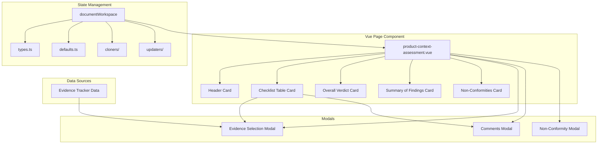

# Design Document: Product Context Assessment Summary

## Overview

The Product Context Assessment Summary page provides a comprehensive checklist interface for assessing conformance with EN 40000 Clause 6.2 requirements. The page enables compliance assessors to systematically evaluate product context requirements, link evidence from the evidence tracker, record Pass/Fail status, add comments, and document non-conformities.

The page follows the existing CRA Tool patterns using Nuxt 4, Vue 3, Nuxt UI v4, and integrates with the documentWorkspace state management system.

## Architecture



## Components and Interfaces

### Page Component: `/app/pages/risk/product-context-assessment.vue`

The main page component containing:

1. **Header Card** - Section title, reference, and navigation button
2. **Assessment Checklist Card** - Table with requirement rows
3. **Overall Verdict Card** - Radio group for PASS/PARTIAL/FAIL/N/A
4. **Summary of Findings Card** - WYSIWYG editor with template button
5. **Non-Conformities Card** - CRUD table for NC entries

### Modal Components (inline in page)

1. **Evidence Selection Modal** (`UModal`)
   - Displays evidence entries from workspace
   - Allows single selection
   - Returns selected evidence reference ID

2. **Comments Modal** (`UModal`)
   - Contains RichTextEditor component
   - Pre-populates with existing content
   - Save/Cancel actions

3. **Non-Conformity Modal** (`UModal`)
   - Form fields: NC ID, Requirement, Description, Severity, Corrective Action
   - Create/Edit modes
   - Save/Cancel/Delete actions

### Assessment Checklist Structure

The checklist is organized by subsections with the following requirement IDs:

| Subsection | IDs |
|------------|-----|
| 6.2.2 Input Documentation | 6.2.2-a through 6.2.2-e |
| 6.2.3 Product Context Requirements | 6.2.3-a through 6.2.3-i |
| 6.2.4 Output | 6.2.4-a, 6.2.4-b |
| 6.2.5 Assessment Criteria | 6.2.5-a, 6.2.5-b |

Requirements 6.2.3-f, 6.2.3-g, 6.2.3-h include N/A option.

## Data Models

### New Types in `types.ts`

```typescript
// Assessment status for each requirement
export type AssessmentStatus = 'not_assessed' | 'pass' | 'fail' | 'na'

// Overall verdict for the clause
export type OverallVerdict = 'pass' | 'partial' | 'fail' | 'na' | 'not_assessed'

// Non-conformity severity levels
export type NCSeverity = 'minor' | 'major' | 'critical'

// Individual requirement assessment entry
export interface RequirementAssessmentEntry {
  id: string                    // e.g., "6.2.2-a"
  evidenceId: string           // Reference to evidence entry ID
  evidenceRefId: string        // Display reference ID from evidence
  status: AssessmentStatus
  commentsHtml: string
}

// Non-conformity entry
export interface NonConformityEntry {
  id: string                   // e.g., "NC-6.2-01"
  requirementId: string        // e.g., "6.2.3-f"
  description: string
  severity: NCSeverity
  correctiveAction: string
}

// Product Context Assessment state
export interface ProductContextAssessmentState {
  assessments: RequirementAssessmentEntry[]
  overallVerdict: OverallVerdict
  summaryOfFindingsHtml: string
  nonConformities: NonConformityEntry[]
}
```

### State Location

The assessment state will be stored under `riskManagement.productContextAssessment` in the DocumentWorkspaceState.

### Requirement Definitions (Constants)

```typescript
export const PRODUCT_CONTEXT_REQUIREMENTS = [
  // 6.2.2 Input Documentation
  { id: '6.2.2-a', subsection: '6.2.2', label: 'Input Documentation', 
    description: 'Functional use cases (user stories) documented', hasNa: false },
  { id: '6.2.2-b', subsection: '6.2.2', label: 'Input Documentation',
    description: 'User types identified and documented', hasNa: false },
  // ... all requirements
  { id: '6.2.3-f', subsection: '6.2.3', label: 'Product Context Requirements',
    description: 'RDPS dependencies recorded (if applicable)', hasNa: true },
  // ... etc
]
```

## Correctness Properties

*A property is a characteristic or behavior that should hold true across all valid executions of a system-essentially, a formal statement about what the system should do. Properties serve as the bridge between human-readable specifications and machine-verifiable correctness guarantees.*

### Property 1: Evidence modal displays all tracker entries
*For any* set of evidence entries in the document workspace, when the evidence selection modal opens, all entries SHALL be displayed with their title, reference ID, and status.
**Validates: Requirements 2.2**

### Property 2: Evidence selection updates cell correctly
*For any* evidence entry selected from the modal, the assessment table cell SHALL display that entry's user-defined reference ID exactly as stored.
**Validates: Requirements 2.3**

### Property 3: Modal cancel preserves evidence state
*For any* initial evidence value in an assessment entry, closing the evidence modal without selection SHALL preserve the original value unchanged.
**Validates: Requirements 2.4**

### Property 4: Comments modal hydrates existing content
*For any* existing comment HTML content in an assessment entry, opening the comments modal SHALL pre-populate the editor with that exact content.
**Validates: Requirements 3.2**

### Property 5: Comments save persists and previews
*For any* HTML content saved in the comments modal, the content SHALL be persisted to workspace state and a truncated preview SHALL be displayed in the table cell.
**Validates: Requirements 3.3**

### Property 6: Comments cancel preserves state
*For any* initial comment value and any edits made in the modal, canceling SHALL discard edits and preserve the original value.
**Validates: Requirements 3.4**

### Property 7: Status checkbox mutual exclusivity
*For any* requirement assessment, checking "Pass" SHALL uncheck "Fail" (and vice versa), and the persisted status SHALL match the checked option.
**Validates: Requirements 4.2, 4.3**

### Property 8: Overall verdict persistence
*For any* overall verdict selection, the value SHALL be immediately persisted to workspace state and visually indicated.
**Validates: Requirements 5.2, 5.3**

### Property 9: Summary content persistence
*For any* HTML content entered in the summary editor, the content SHALL be persisted to the document workspace state.
**Validates: Requirements 6.2**

### Property 10: Template insertion preserves content
*For any* existing content in the summary editor, inserting the template SHALL preserve the existing content and append the template text.
**Validates: Requirements 6.4**

### Property 11: NC entry persistence
*For any* valid non-conformity entry saved, the entry SHALL be added to the table and persisted to workspace state.
**Validates: Requirements 7.4**

### Property 12: NC deletion persistence
*For any* non-conformity entry deleted, the entry SHALL be removed from the table and the change SHALL be persisted.
**Validates: Requirements 7.6**

### Property 13: State round-trip consistency
*For any* assessment state persisted to workspace, loading the page SHALL hydrate all form fields with the exact persisted values.
**Validates: Requirements 8.1, 8.2**

### Property 14: External state subscription
*For any* external change to the workspace state, the page SHALL update displayed data to reflect the new state.
**Validates: Requirements 8.3**

## Error Handling

1. **Empty Evidence Tracker**: Display empty state message in modal directing user to add evidence first
2. **Invalid State**: Use default values from `defaults.ts` when state is missing or malformed
3. **Hydration Conflicts**: Use `hydrating` ref flag to prevent save loops during state hydration
4. **Modal State**: Reset modal forms on close to prevent stale data

## Testing Strategy

### Property-Based Testing Library
Use **fast-check** for property-based testing in TypeScript/JavaScript.

### Unit Tests
- Verify requirement definitions constant has all expected entries
- Verify default state structure
- Verify cloner produces deep copies
- Verify updater merges state correctly

### Property-Based Tests
Each correctness property above will be implemented as a property-based test using fast-check. Tests will:
- Generate random assessment states
- Generate random evidence entries
- Generate random HTML content
- Verify properties hold across all generated inputs

Test annotations will follow format:
```typescript
// **Feature: product-context-assessment, Property 1: Evidence modal displays all tracker entries**
```

### Integration Tests
- Page renders with correct structure
- Modal interactions work correctly
- State persists across page navigation
